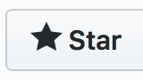

# Liste de chaînes YouTube Françaises pour apprendre le développement web

> Si vous souhaitez que j'ajoute une chaîne YouTube à cette liste, contactez-moi sur jeremy@javascriptdezero.com ou via Twitter [@JeremyMouzin](https://twitter.com/jeremymouzin).   👋 Merci à tous ceux qui ont déjà partagé leurs chaînes préférées !

Il n'est pas facile de trouver les YouTubeurs Francophones parlant de développement web via le moteur de recherche YouTube. Cette liste est là pour vous aider à trouver les pépites Françaises pas toujours bien référencées.

*Vous aimez cette liste ? Appuyez sur le bouton étoile en haut à droite . Merci !*

